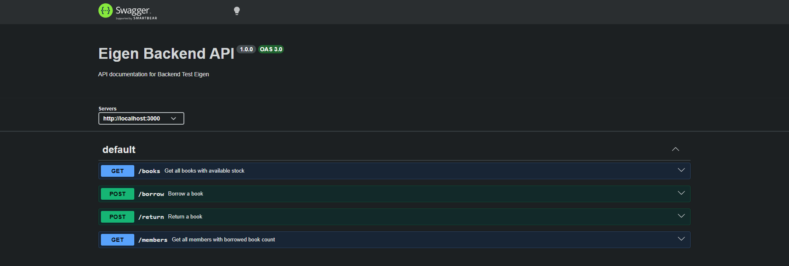
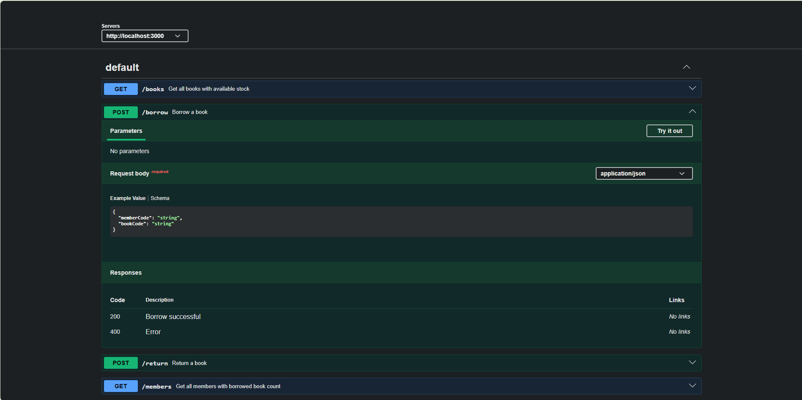

# 📚 Library Management API - Eigen Backend Test

This project is a backend API built to fulfill the technical test requirements from PT Eigen Tri Mathema.

---

## 🚀 Tech Stack

* Node.js (Express)
* TypeScript
* Prisma ORM
* SQLite
* Swagger (API Documentation)

---

## 📦 Installation

Clone the repository:

```bash
git clone https://github.com/superizky27/backend-test-eigen
cd backend-test-eigen
```

Install dependencies:

```bash
npm install
```

---

## ⚙️ Setup Database

Run migration:

```bash
npx prisma migrate dev
```

Seed initial data:

```bash
npx ts-node prisma/seed.ts
```

---

## ▶️ Run Server

```bash
npm run dev
```

Server will run at:

```
http://localhost:3000
```

---

## 📑 API Documentation

Swagger documentation is available at:

```
http://localhost:3000/api-docs
```


### 📸 Preview

#### Overview


#### Borrow Endpoint Example


---

## 📌 API Endpoints

### 📚 Books

* `GET /books` → Get all books

---

### 👤 Members

* `GET /members` → Get all members with total borrowed books

---

### 📥 Borrow Book

* `POST /borrow`

Request body:

```json
{
  "memberCode": "M001",
  "bookCode": "JK-45"
}
```

Response (Success):

```json
{
  "success": true,
  "data": {
    "memberCode": "M001",
    "bookCode": "JK-45"
  }
}
```

Response (Error):

```json
{
  "success": false,
  "message": "Book not available"
}
```

---

### 📤 Return Book

* `POST /return`

Request body:

```json
{
  "memberCode": "M001",
  "bookCode": "JK-45"
}
```

Response:

```json
{
  "success": true,
  "message": "Book returned successfully"
}
```

---

## ⚠️ Business Rules

* Each member can borrow a maximum of **2 books**
* Books can only be borrowed if **stock is available**
* Members **cannot borrow during penalty period**
* Penalty rules:

  * If a book is returned after more than **7 days**
  * The member will be penalized for **3 days**

---

## 📂 Project Structure

```
src/
 ├── controllers/
 ├── services/
 ├── routes/
 ├── database/
 └── app.ts
```

---

## ✨ Features

* Clean architecture (Controller → Service → Database)
* RESTful API design
* Database integration with Prisma ORM
* Swagger API documentation
* Business logic implementation (borrow, return, penalty, stock management)
* Error handling

---

## 🧠 Notes

This project is designed to demonstrate backend development skills including:

* API development using Express + TypeScript
* Database management using Prisma
* Handling business logic and edge cases
* Writing clean and maintainable code

---

## 📬 Author

**Rizky Ilhamsyah**
